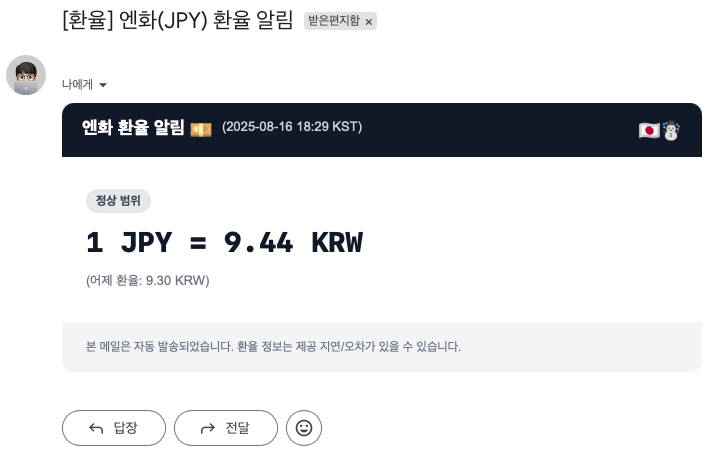
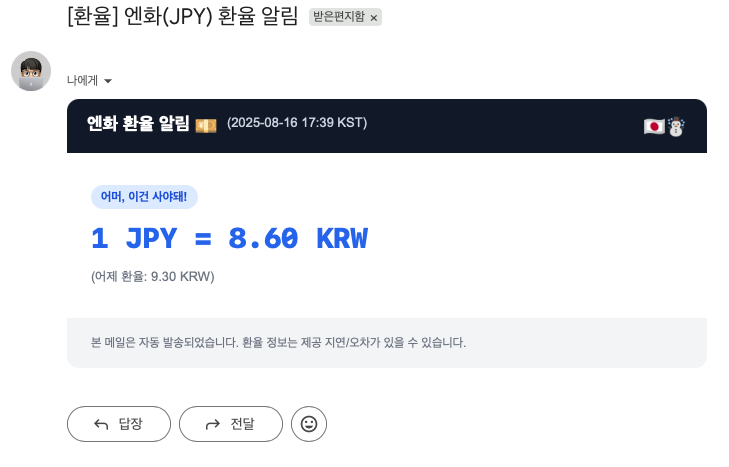
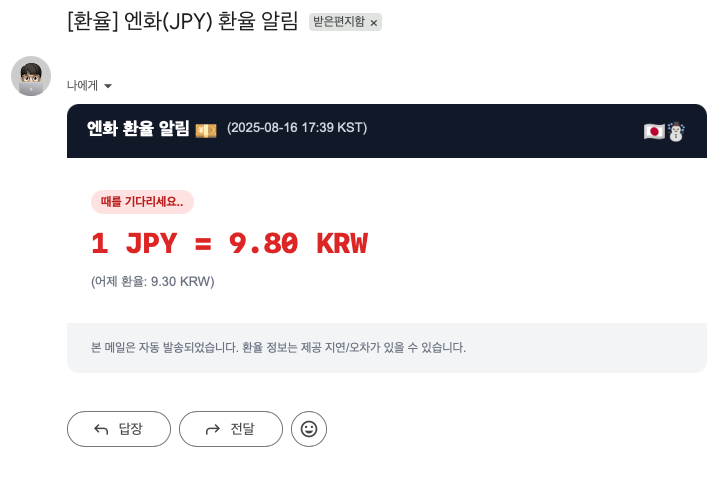
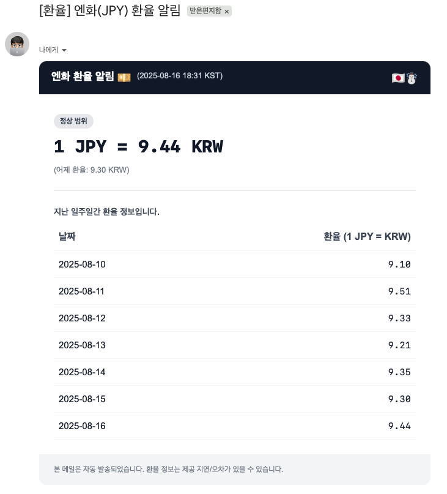

# Saporo — 일일 엔화 알림 프로그램 🇯🇵⛄

엔화(JPY) ↔ 원화(KRW) 환율을 조회하여 매일 오전 10시(KST)에 메일로 알려주고, 매주 월요일에는 지난 7일 간의 환율을 표로 보내주는 작은 스프링부트 애플리케이션입니다.

- 데이터 출처: https://open.er-api.com/v6/latest/KRW
- 메일 템플릿: Thymeleaf(HTML)
- 스케줄: Spring Scheduling(Asia/Seoul)
- 저장소: 일자별 JSON 파일(기본: ./rates)

---

### 스크린샷
엔화 알림 메일 예시 <br>





---

## 주요 기능
- 일일 알림: 오늘의 1 JPY = KRW 환율을 메일로 전송합니다.
- 주간 요약: 매주 월요일, 최근 7일 데이터를 표로 정리하여 메일로 전송합니다.
- 임계값 배지 표시: min/max 값 기준으로 상태 배지(“어머, 이건 사야돼!”, “정상 범위”, “때를 기다리세요..”)를 표시합니다.
- 파일 저장: 각 날짜별 환율을 JSON 파일로 저장합니다. (예: `rates/2025-08-16.json`)
- 오래된 파일 정리: 월요일에 오늘·어제 파일만 남기고 이전 파일은 정리 시도합니다.


## 작동 방식 개요
- 10:00 KST에 스케줄 실행(ScheduleService)
  1) API에서 KRW 기준 JPY 환율을 받아 1 JPY = KRW 로 변환(소수점 2자리 반올림)
  2) 오늘 날짜 파일 저장(RateFileRepository)
  3) 월요일이면 지난 7일 데이터를 모아 주간 메일 전송, 실패 시 일일 메일로 대체
  4) 월요일에 오래된 파일 삭제(오늘·어제 제외)
- 메일은 JavaMailSender + Thymeleaf 템플릿을 사용해 HTML로 발송합니다.

관련 코드: 
- ExchangeRateService: 환율 조회/변환
- ScheduleService: 스케줄링 및 주간/일일 메일 분기 + 파일 정리
- MailService: 메일 컨텐츠 구성 및 발송
- RateFileRepository: 파일 저장/조회/삭제


## 빠른 시작
### 1) 필요 조건
- Java 21+
- Maven 3.9+
- Gmail 발신 계정(App Password 권장)

### 2) 환경 설정(application.yml)
`src/main/resources/application.yml`에서 다음 값을 환경에 맞게 수정하세요. 민감정보는 절대 평문으로 커밋하지 말고 외부 설정 또는 환경변수를 사용하세요.

```yaml
spring:
  mail:
    host: smtp.gmail.com
    port: 587
    username: <your_gmail_address>
    password: <your_app_password> # 앱 비밀번호 사용 권장
    properties:
      mail.smtp.auth: true
      mail.smtp.starttls.enable: true

server:
  port: 8080
  address: 0.0.0.0

mail-receiver: <receiver_email>
min-value: 8.90   # 구매 고려 하단 임계값
max-value: 9.80   # 관망 상단 임계값
rate-file-path: ./rates
```

Tip: 운영에서는 `-Dspring.config.location` 또는 환경변수(SPRING_MAIL_USERNAME, SPRING_MAIL_PASSWORD 등)로 덮어쓰세요.

### 3) 실행
- 개발 모드(소스 실행)
  ```bash
  ./mvnw spring-boot:run
  ```
- 패키징 후 실행
  ```bash
  ./mvnw -DskipTests package
  java -jar target/saporo-1.0.0.jar
  ```

### 4) 동작 확인(수동 트리거)
테스트용 컨트롤러가 제공됩니다. (참고: `pom.xml`의 maven-compiler-plugin 설정에서 `TestController`가 빌드 제외되어 있을 수 있습니다. 필요 시 제외 설정을 해제하세요.)
- 일일 메일 즉시 전송
  ```bash
  curl -X POST http://localhost:8080/api/send-email
  ```
- 스케줄 로직 수동 실행(오늘 기준 동작)
  ```bash
  curl -X POST http://localhost:8080/api/schedule
  ```


## 디렉터리 구조
```
saporo/
├─ bin/
│  └─ saporo.sh           # 배포 스크립트(예: start/stop)
├─ rates/                 # 일자별 환율 JSON 저장 위치(기본)
├─ src/
│  ├─ main/java/project/saporo/
│  │  ├─ SaporoApplication.java
│  │  ├─ config/WebConfig.java
│  │  ├─ controller/TestController.java
│  │  ├─ service/
│  │  │  ├─ ExchangeRateService.java
│  │  │  ├─ MailService.java
│  │  │  └─ ScheduleService.java
│  │  ├─ repository/RateFileRepository.java
│  │  ├─ dto/DailyRate.java
│  │  └─ code/{TimeConst, FileConst}.java
│  └─ main/resources/
│     ├─ application.yml
│     └─ templates/mail/
│        ├─ jpy-rate-daily.html
│        └─ jpy-rate-weekly.html
└─ pom.xml
```


## 메일 템플릿 미리보기
- jpy-rate-daily.html: 오늘 환율과 전일 대비 문구, 임계값 배지 표시
- jpy-rate-weekly.html: 오늘/전일 정보 + 지난 7일 표 표시

템플릿 변수
- sentAt: 발송 시각(Asia/Seoul)
- rate: 오늘 환율(1 JPY = KRW)
- yesterdayRate: 전일 환율(옵션)
- minValue/maxValue: 임계값
- days: 주간 목록(List<DailyRate>)


## 배포 스크립트(bin/saporo.sh)
lib/ 폴더에 `saporo-1.0.0.jar`, resource/ 폴더에 `application.yml`, `logback.xml`을 두고 아래처럼 사용합니다.
```bash
./bin/saporo.sh start   # 백그라운드 실행, 로그는 log/app.out
./bin/saporo.sh stop    # 종료
```
내부적으로 다음 JVM 옵션을 사용합니다.
- `-Dspring.config.location=resource/application.yml`
- `-Dlogging.config=resource/logback.xml`


## 유의사항 & 트러블슈팅
- Gmail은 2단계 인증과 App Password 사용을 권장합니다. 일반 비밀번호는 동작하지 않을 수 있습니다.
- 방화벽/네트워크 정책으로 외부 API 호출(`open.er-api.com`) 또는 SMTP(587)가 차단될 수 있습니다.
- 스케줄은 서버 로컬 시간이 아닌 `Asia/Seoul` 기준입니다. 컨테이너/서버의 타임존을 확인하세요.
- 파일 저장 경로(`rate-file-path`)는 애플리케이션 실행 사용자에게 쓰기 권한이 있어야 합니다.
- 월요일 정리 로직은 오늘·어제 파일을 남기고 그 이전 파일을 삭제 시도합니다. 백업이 필요하면 별도 디렉터리를 사용하세요.


## 라이선스
내부/개인 사용 목적의 샘플 프로젝트입니다. 별도 라이선스가 명시되지 않았다면 저장소 소유자의 가이드에 따르세요.